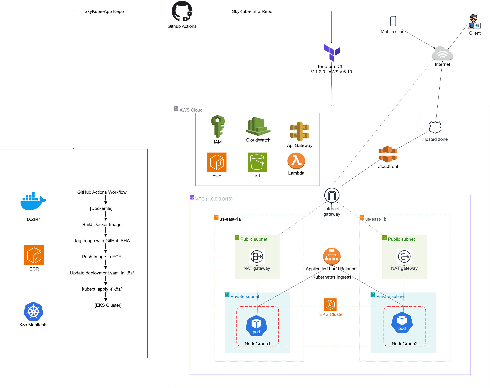

# 🌌 SkyKube - Cloud-Native Voice Notes Platform

**SkyKube** is a cloud-native project designed to demonstrate end-to-end DevOps practices using **AWS, Terraform, Docker, Kubernetes, and CI/CD automation**.  
The project is divided into two repositories:  

- **[SkyKube-Infra](https://github.com/gursimran531/SkyKube-Infra.git)** — Contains all Infrastructure as Code (IaC) components built with Terraform (VPC, EKS, ECR, S3, Lambda, Route 53, CloudFront, IAM, etc.).  
- **[SkyKube-App](https://github.com/gursimran531/SkyKube-App.git)** — Contains the application source code, Kubernetes manifests, and GitHub Actions workflow for automated CI/CD deployment to AWS EKS.

---

[](https://developer.hashicorp.com/terraform/docs) [](https://registry.terraform.io/providers/hashicorp/aws/latest)

---

# SkyKube Infrastructure

This repository contains the **infrastructure code** for the SkyKube project using **Terraform**. The infrastructure includes all cloud resources required to deploy the SkyKube application.

> **Note:** SkyKube application code is maintained in a separate repository: [SkyKube-App](https://github.com/gursimran531/SkyKube-App.git)

---

## Architecture Overview

The SkyKube infrastructure is designed to be **secure, scalable, and modular**. The main components are:

- **VPC & Subnets**
  - Public subnets: For Load Balancer, NAT gateways (if needed)
  - Private subnets: For EKS nodes, RDS, and other internal resources

- **EKS Cluster**
  - Private node groups deployed across multiple availability zones
  - Helm used to install the **AWS Load Balancer Controller**
  - Supports Kubernetes deployments from GitHub Actions

- **IAM Roles**
  - Roles for EKS, Lambda, and other AWS services with least privilege policies

- **ECR**
  - Container registry for application images
  - Scan-on-push enabled for security

- **Lambda & API Gateway**
  - Serverless backend for the application
  - Lambda functions handle voice note processing
  - API Gateway provides HTTP endpoints

- **S3**
  - Storage for voice notes
  - Presigned URLs used for secure access

- **CloudFront & Route 53**
  - CloudFront CDN in front of ALB and API Gateway
  - Custom domain managed via Route 53
  - Provides HTTPS termination and caching

- **CloudWatch**
  - Logging and monitoring for EKS, Lambda, and other AWS resources

---

## Diagram

> 


---

## Issues Faced

During the setup, some challenges were encountered:

1. **AWS Load Balancer Controller installation**
   - Initially faced issues with IAM permissions for the controller
   - Cluster roles and service account needed precise configuration
   - Helm installation required careful namespace and version management

2. **Ingress vs Load Balancer**
   - Using an **Ingress** with AWS LB Controller provides:
     - Single entry point with path-based routing
     - TLS termination at ingress level for secure traffic
     - Better cost optimization compared to creating multiple Load Balancers
   - Direct LoadBalancer service per app can increase cost and exposes multiple endpoints, reducing centralized security control

---

## Best Practices Implemented

- **Infrastructure as Code (IaC)** using Terraform
- **Modular architecture** for VPC, EKS, IAM, Lambda, and networking
- **Least privilege IAM roles** for all services
- **Multi-AZ deployment** for high availability
- **Automatic deployments** via GitHub Actions workflows
- **CloudFront in front of public endpoints** for secure and fast access
- **Presigned URLs** for S3 access instead of public buckets
- **CloudWatch logging and metrics** enabled for observability
- **ECR scan-on-push** to ensure container security

---

## Folder Structure

```
SkyKube-Infra/
│
├─ modules/
│   ├─ vpc/
│   ├─ eks/
│   ├─ iam/
│   ├─ ecr/
│   ├─ lambda/
|   ├─ s3/
│   └─ dns/
|
│
├─ environments/
│   ├─ dev/
│   └─ prod/
│
└─ main.tf
```

---

## Deployment

1. Configure your **AWS CLI** credentials.
2. Initialize Terraform modules:
   ```bash
   terraform init
   ```
3. Validate configuration:
   ```bash
   terraform validate
   ```
4. Plan changes:
   ```bash
   terraform plan -out=tfplan
   ```
5. Apply infrastructure:
   ```bash
   terraform apply tfplan
   ```

---

## Notes

- CloudFront provides SSL/TLS termination, caching, and CDN benefits.
- Lambda and API Gateway are fully serverless for backend processing.
- Security is layered: VPC subnets, IAM roles, CloudFront, and presigned URLs.

- Once the infrastructure is created, you’ll need to deploy the application so that the ALB (Application Load Balancer) is provisioned. After that, you can use the ALB’s DNS name when setting up CloudFront to ensure proper routing. I also encountered a few issues related to security group configurations during this process that I had to manually allow traffic from alb sg to node group sg — any suggestions or improvements would be greatly appreciated.